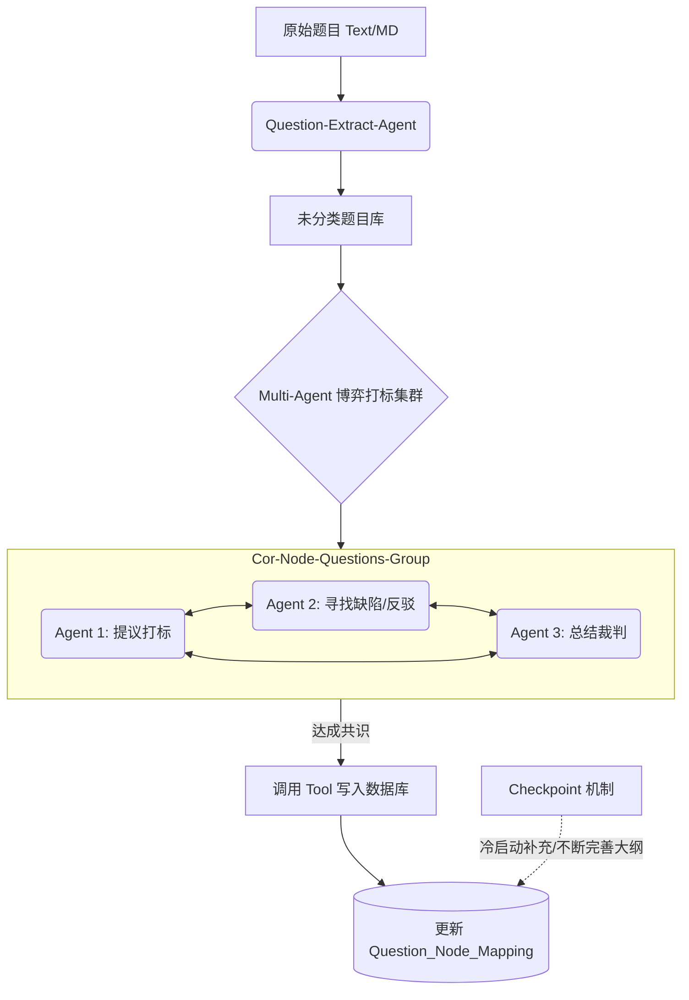
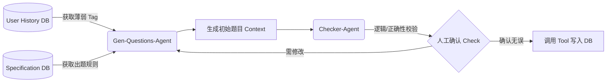

# AI Agent 教育知识图谱与智能题库系统设计文档

## 1. 系统概述
本系统是一个基于大语言模型（LLM）和多智能体（Multi-Agent）架构的智能化教育题库系统。系统涵盖了从教学大纲的自动化拆解、实体题目提取与智能打标，到基于用户学情的个性化题目生成的完整闭环。

### 1.1 核心设计理念
* **动态细化抽取**：摒弃僵化的“一次性完美拆解大纲”思维。采用“粗颗粒度大纲建立 + 基于具体题目反向动态细化知识点”的敏捷策略。
* **多智能体博弈（Multi-Agent Debate）**：引入多 Agent 交叉验证机制（拆解、找问题、辩论），大幅降低单一大模型的“幻觉”，提高知识点拆解与题目打标的准确率。
* **人机协同（Human-in-the-loop）**：在核心的入库环节引入 Checker-Agent 与人工确认机制，保障教育题库的绝对严谨性。
* **数据向量化**：结合结构化关系型数据库与向量检索技术，提升相似题匹配与 RAG（检索增强生成）的效果。

---

## 2. 数据库设计 (Database Schema)

为了支撑复杂的图谱关系和业务逻辑，数据库采用关系型与中间表结合的设计。

### 2.1 知识图谱核心表

**表 1：大纲表 (`outline`)**
| 字段名 | 数据类型 | 描述 |
| :--- | :--- | :--- |
| `id` | INT | 主键 |
| `name` | VARCHAR | 大纲名称（如：2026考研数学一） |
| `desc` | TEXT | 大纲整体描述 |
| `metadata` | JSON / TEXT | 元数据 (用于适配不一致的大纲结构，如解析规则、版本等) |

**表 2：知识节点表 (`node`)** - *采用邻接表设计，支持无限极树状结构*
| 字段名 | 数据类型 | 描述 |
| :--- | :--- | :--- |
| `id` | INT | 主键 |
| `outline_id` | INT | 外键，关联大纲表 |
| `f_node` | INT | 父节点 ID（Root节点为空或0） |
| `desc` | TEXT | 知识点描述/详情 |
| `level` | INT | 节点层级（1: 学科, 2: 章节, 3: 考点等） |
| `status` | TINYINT | 状态（1: 启用, 0: 废弃/合并） |

### 2.2 题库与关联表

**表 3：题目主表 (`question`)** - *仅存题干，保持独立*
| 字段名 | 数据类型 | 描述 |
| :--- | :--- | :--- |
| `id` | INT | 主键 |
| `context` | TEXT | 题目正文（Markdown/Tex格式） |
| `type` | VARCHAR | 题目来源类型（真题 / 模拟题 / AI生成） |

**表 4：题目-知识点多对多关联表 (`question_node_mapping`)** - *解决综合题跨知识点问题*
| 字段名 | 数据类型 | 描述 |
| :--- | :--- | :--- |
| `id` | INT | 主键 |
| `question_id` | INT | 外键，关联题目表 |
| `node_id` | INT | 外键，关联节点表 |
| `weight` | FLOAT | 该知识点在此题中的权重（可选） |

**表 5：答案与解析表 (`question_answer`)** - *动静分离，便于分发与盲测*
| 字段名 | 数据类型 | 描述 |
| :--- | :--- | :--- |
| `question_id` | INT | 外键，关联题目表 |
| `answer_content`| TEXT | 标准答案 |
| `analysis` | TEXT | 详细解析 |

### 2.3 业务与生成依赖表

**表 6：生成规则表 (`specification`)**
| 字段名 | 数据类型 | 描述 |
| :--- | :--- | :--- |
| `id` | INT | 主键 |
| `node_id` | INT | 关联的核心知识点 |
| `prompt_rules` | TEXT | AI出题归档规则，按 Node/Question 定制 |

### 表 7：用户做题历史表

#### 表 7A：用户做题流水表 (`user_action_log`) —— 记录“发生过什么”
*这是一个 Append-only（只增不改）的日志表，记录用户每一次的做题切片。*

| 字段名 | 数据类型 | 描述 | 设计意图 / AI 用途 |
| :--- | :--- | :--- | :--- |
| `id` | INT | 主键 | |
| `user_id` | INT | 用户 ID | |
| `question_id` | INT | 题目 ID | |
| `user_answer` | TEXT | **用户实际提交的答案** | AI 用于对比标准答案，发现具体漏洞（如公式写错、符号反了）。 |
| `is_correct` | TINYINT | 结果（1全对, 2半对/部分给分, 0全错）| 引入“部分给分”机制，比单纯的 Boolean 更细腻。 |
| `time_spent` | INT | **做题耗时（秒）** | 耗时过长即使对了也是“不熟练”，AI 可据此推同类题练速度。 |
| `error_type   ` | JSON | **错误类型标签** | AI 分析出的通用错误归类（如：`计算失误`、`概念混淆`、`审题不清`）。 |
| `ai_analysis` | TEXT | **AI 详细诊断说明** | AI Agent 针对 `user_answer` 生成的专属错误解析。 |
| `timestamp` | DATETIME | 做题时间 | 用于计算艾宾浩斯遗忘曲线。 |

#### 表 7B：用户知识点掌握状态表 (`user_node_mastery`) —— 记录“当前什么状态”
*这是一个不断被 Update 的表。每次用户做完题，后台 Agent 或服务会聚合更新此表。它解决了“错了多少次之后对了，过了多久又错了”的追踪需求。*

| 字段名 | 数据类型 | 描述 | 设计意图 / AI 用途 |
| :--- | :--- | :--- | :--- |
| `id` | INT | 主键 | |
| `user_id` | INT | 用户 ID | |
| `node_id` | INT | **知识节点 ID** | 追踪用户对某个**具体知识点**的掌握度，而不是单道题。 |
| `mastery_level`| FLOAT | **掌握度得分 (0.0 ~ 1.0)** | 核心指标：基于贝叶斯知识追踪（BKT）或简单加权计算出的当前熟练度。 |
| `consecutive_correct`| INT | **连续答对次数** | 如果连对3次，AI 下次就不推基础题，直接推 `level` 更高的拔高题。 |
| `total_attempts` | INT | 历史总尝试次数 | 结合对错率，判断是“顽固性易错点”还是“偶尔马虎”。 |
| `last_reviewed_at`| DATETIME | **最后一次触达时间** | 判断该知识点是否已经“生疏”。 |
| `next_review_at` | DATETIME | **下次推荐复习时间** | 类似 Anki 的记忆算法（SM-2），系统自动推算何时该重新出现该知识点的题。 |

---

## 3. 多智能体工作流设计 (Multi-Agent Workflows)

系统业务流程由负责不同单一职责的 Agents 协同完成。

### 3.1 大纲解析与建库流 (Outline Ingestion Workflow)
**目标**：将非结构化的大纲文档转化为结构化的 `node` 树。
```mermaid
graph LR
    A[大纲文档 PDF/Word] --> B[OCR / 转为 Markdown]（如果直接为md或txt则跳过）
    B --> C(Outline-Agent)
    C -- "按分批次(Chunk)解析\n保障上下文不丢失" --> D[调用 Tool 解析结构]
    D --> E[(写入 Node 数据库)]
```

### 3.2 题目提取与智能打标流 (Question Extraction & Tagging Workflow)
**目标**：处理未分类题库，拆解题目并关联到对应的知识点（`node`）。


### 3.3 AI 智能出题流 (Generation Workflow)
**目标**：基于用户薄弱点和知识点规则，生成全新题目。


---

## 4. 技术栈选型建议 (Tech Stack Recommendations)

1. **大模型编排框架**: 
   * 强烈推荐使用 **LangGraph** 或 **微软 AutoGen**。它们天生支持带环路（Cycles）的状态机和多智能体对话（Agent Debate），非常契合本系统的 `cor-node-questions` 辩论逻辑。
2. **结构化输出约束**: 
   * 在所有 Agent 调用 Tool 写入 DB 的环节，必须使用 OpenAI Function Calling 或通过 `Instructor` / `Marvin` 等库强制 LLM 输出 JSON 格式，防止字段解析崩溃。
3. **向量数据库 (Vector DB)**: 
   * 建议引入 **Milvus**, **Qdrant** 或直接使用 PostgreSQL 的 **PGVector** 插件。将提取的题目进行 Embedding 化存储。